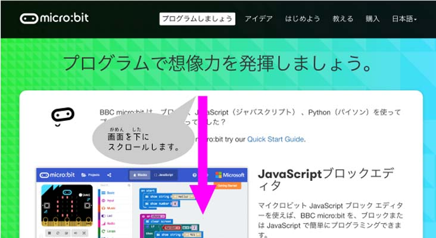
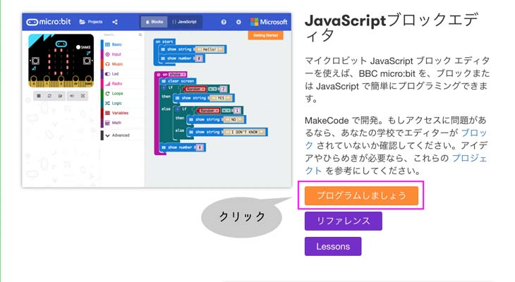
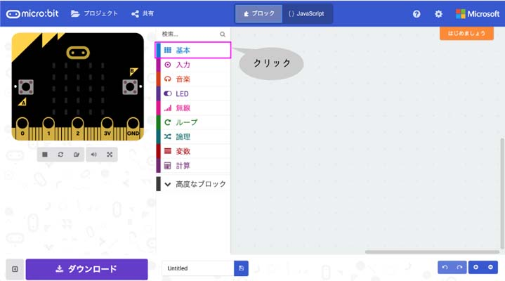
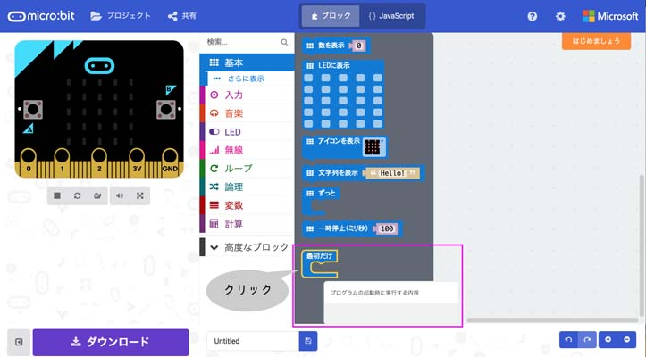
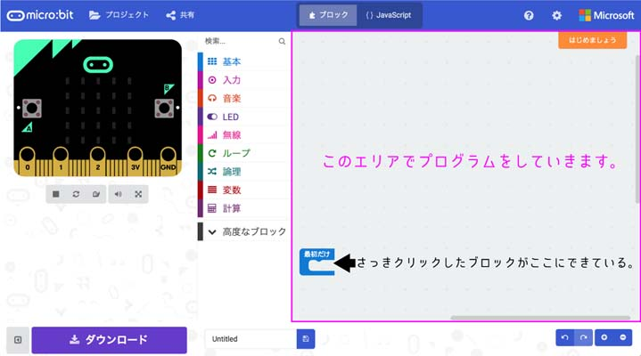
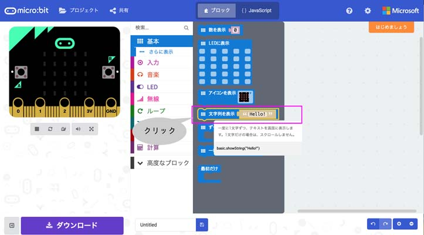
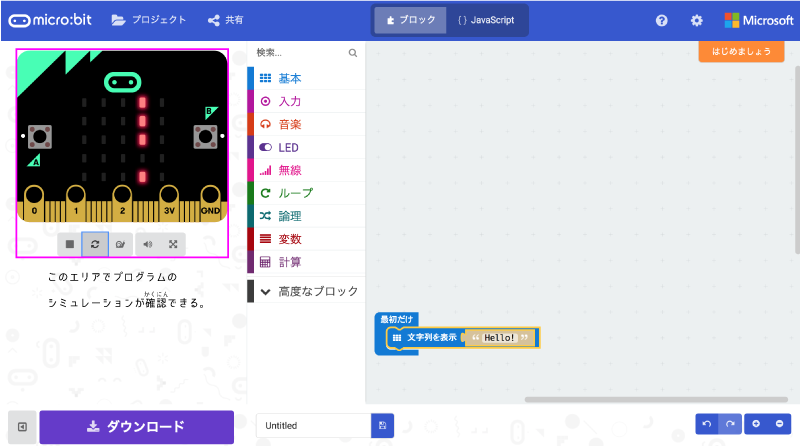

# [Micro:bit]("http://microbit.org/")
---

---

---

---

---

---

##### 「<ruby>基本<rp>（</rp><rt>きほん</rt><rp>）</rp></ruby>」をクリックしましょう。
---

##### 「<ruby>最初<rp>（</rp><rt>さいしょ</rt><rp>）</rp></ruby>だけ」をクリックしましょう。
---

##### 次に、また「<ruby>基本<rp>（</rp><rt>きほん</rt><rp>）</rp></ruby>」をクリックしましょう。
---

##### 「<ruby>文字列<rp>（</rp><rt>もじれつ</rt><rp>）</rp></ruby>を<ruby>表示<rp>（</rp><rt>ひょうじ</rt><rp>）</rp></ruby>」をクリックしましょう。
---

##### 「<ruby>文字列<rp>（</rp><rt>もじれつ</rt><rp>）</rp></ruby>を<ruby>表示<rp>（</rp><rt>ひょうじ</rt><rp>）</rp></ruby>」をドラッグして「<ruby>最初<rp>（</rp><rt>さいしょ</rt><rp>）</rp></ruby>だけ」の中に入れよう。
---

##### 一回だけ「Hello!」という文字が表示される事を左のシミュレーターで確認しよう。

---
