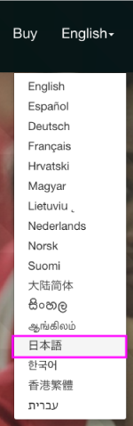
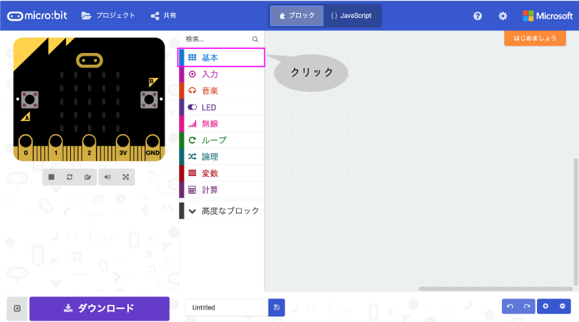

# [Micro:bit]("http://microbit.org/")
---

---

---

---

---

---

##### 「<ruby>基本<rp>（</rp><rt>キホン</rt><rp>）</rp></ruby>」をクリックしましょう。
---

##### 「<ruby>最初<rp>（</rp><rt>さいしょ</rt><rp>）</rp></ruby>だけ」をクリックしましょう。
