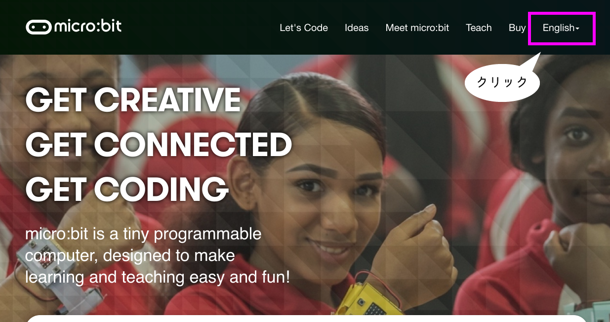
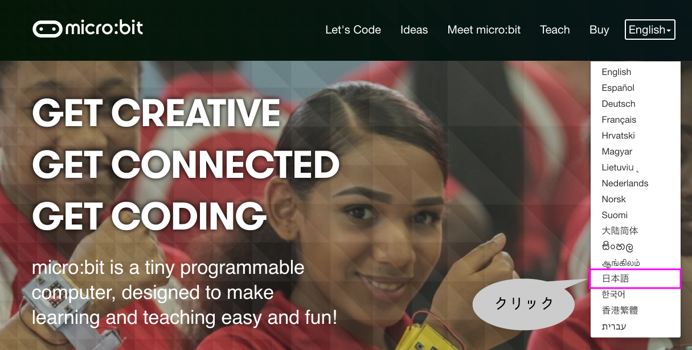
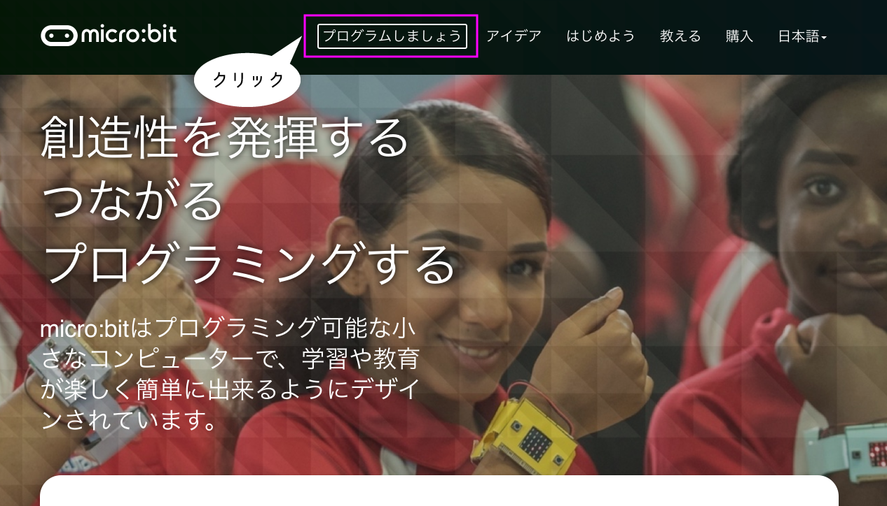

# [Micro:bit]("http://microbit.org/")
---

---

---

---

---

---

##### 「<ruby>基本<rp>（</rp><rt>きほん</rt><rp>）</rp></ruby>」をクリックしましょう。
---

##### 「<ruby>最初<rp>（</rp><rt>さいしょ</rt><rp>）</rp></ruby>だけ」をクリックしましょう。
---

##### 次に、また「<ruby>基本<rp>（</rp><rt>きほん</rt><rp>）</rp></ruby>」をクリックしましょう。
---

##### 「<ruby>文字列<rp>（</rp><rt>もじれつ</rt><rp>）</rp></ruby>を<ruby>表示<rp>（</rp><rt>ひょうじ</rt><rp>）</rp></ruby>」をクリックしましょう。
---

##### 「<ruby>文字列<rp>（</rp><rt>もじれつ</rt><rp>）</rp></ruby>を<ruby>表示<rp>（</rp><rt>ひょうじ</rt><rp>）</rp></ruby>」をドラッグして「<ruby>最初<rp>（</rp><rt>さいしょ</rt><rp>）</rp></ruby>だけ」の中に入れよう。
---

<iframe style="position:absolute;top:0;left:0;width:100%;height:100%;" src="https://makecode.microbit.org/---run?id=_4uV78YFRJhLH" allowfullscreen="allowfullscreen" sandbox="allow-popups allow-forms allow-scripts allow-same-origin" frameborder="0"></iframe>

---
